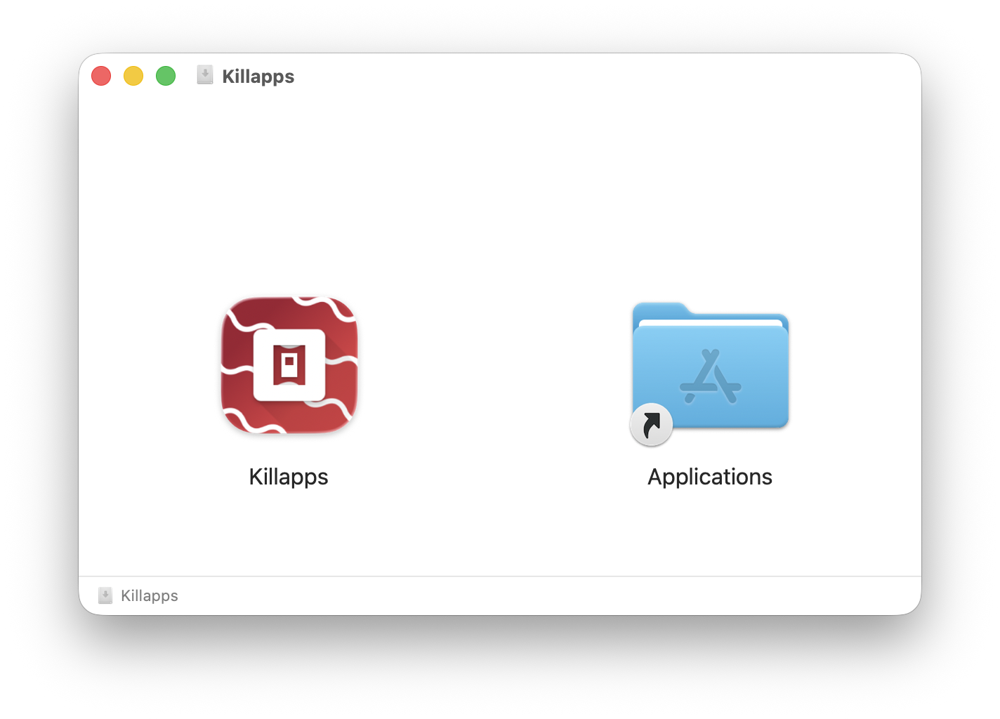
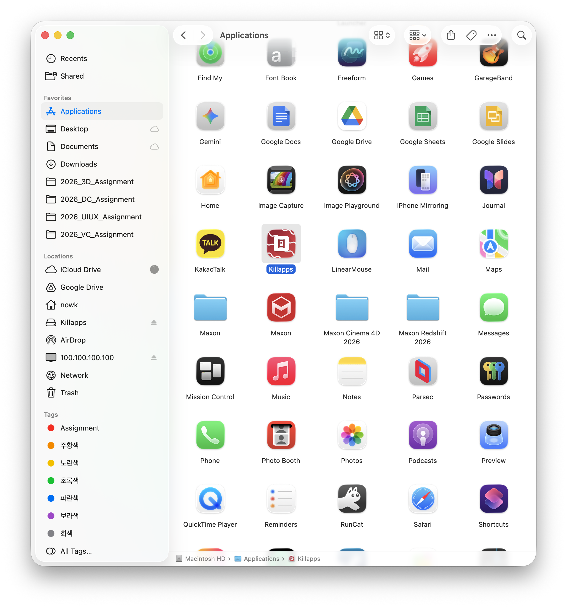
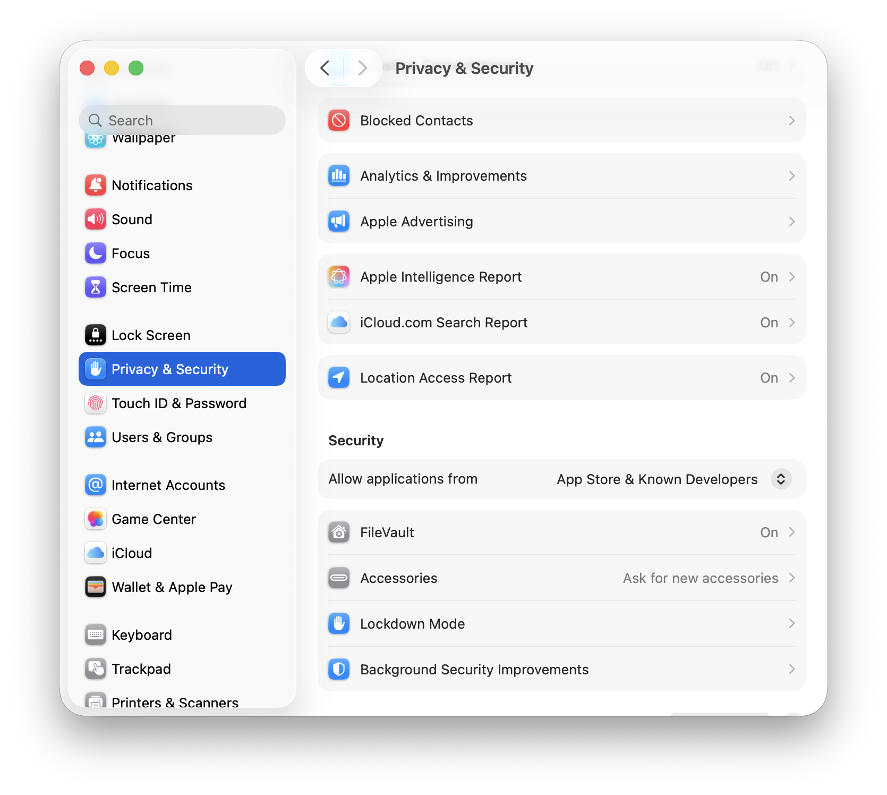

# Killapps

맥에서 메뉴바에서 손쉽게 앱을 종료할 수 있는 앱입니다.

> [!CAUTION]
> 앱 이용 중 예상치 못한 파일 손실은 사용자의 책임입니다.  
> 

> [!NOTE]
> 현재 버전은 베타 버전입니다.
> 그리고 개발공부겸 시작하게 된 프로젝트이기 때문에 차후 업데이트 가능성 꽤나 없습니다.

> [!IMPORTANT]
> dmg 파일을 통해 설치 후, 앱을 한번 실행시킨 뒤
> Settings -> Privacy & Security 로 들어가시고 밑으로 쭉 스크롤 후 Killapps를 허용해 주시고
> 실행시켜주시길 바랍니다. 제가 돈이없어서 인증을 못했습니다.

---

## Installation

현재는 구글드라이브를 통해서만 배포가 가능합니다.

### Download - Google Drive
[Click Here](https://drive.google.com/file/d/1xK_B4ZTE2pFPYxoR981KvZpxstXBwJ4p/view?usp=sharing)

---

## How to use

dmg파일을 이용해 Application 폴더에 설치해주세요.

Killapps를 실행해주시고, 경고창을 닫아주세요.

Settings -> Privacy & Security 로 들어가시고 밑으로 쭉 스크롤 후 Killapps를 허용해 주세요.

한번 허용을 해주시면, 그 뒤로는 정상적으로 열립니다.

---

## Features

- 메뉴바에서 즉시 앱 종료
- 백그라운드 앱 정리
- 메모리 사용량 확인 가능
